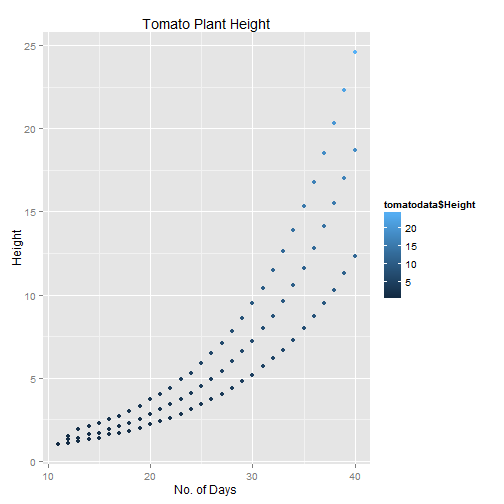
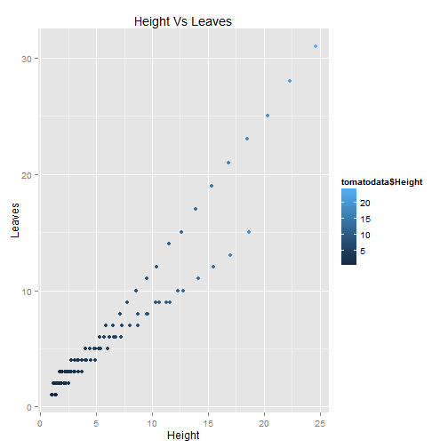
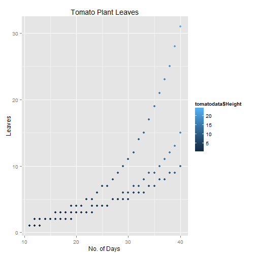
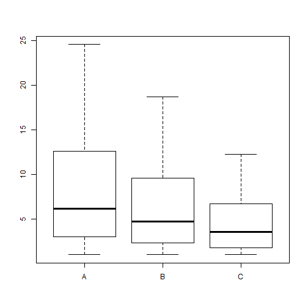

# R language code in markdown page

## Analysis of Tomato plant growth under different light condition

Three plants ( A, B and C ) were exposed to different Light conditions

Plant A was exposed to 12 hours of light every day
Plant B was exposed to 8 hours of light every day
Plant C was exposed to 4 hours of light every day


We draw some interesting plots here in this Repo.


```r
library(ggplot2);
library(dplyr);
library(stringr);

path = "C:\\Users\\dell\\Tomato1"
setwd(path)
tomatodata<- read.csv("Plants.csv")
dim(tomatodata)
```

```
## [1] 90  4
```

```r
names(tomatodata)
```

```
## [1] "Days"   "Height" "Leaves" "Plant"
```

```r
head(tomatodata)
```

```
##   Days Height Leaves Plant
## 1   11    1.0      1     A
## 2   11    1.0      1     B
## 3   11    1.0      1     C
## 4   12    1.5      2     A
## 5   12    1.3      1     B
## 6   12    1.1      1     C
```

```r
str(tomatodata)
```

```
## 'data.frame':	90 obs. of  4 variables:
##  $ Days  : int  11 11 11 12 12 12 13 13 13 14 ...
##  $ Height: num  1 1 1 1.5 1.3 1.1 1.9 1.4 1.2 2.1 ...
##  $ Leaves: int  1 1 1 2 1 1 2 1 2 2 ...
##  $ Plant : Factor w/ 3 levels "A","B","C": 1 2 3 1 2 3 1 2 3 1 ...
```


##Plot of Tomato plant height


```r
g1 <- ggplot(data = tomatodata, aes(x=tomatodata$"Days", y=tomatodata$"Height", color=tomatodata$Height))
g1 = g1 + geom_point();
g1 <- g1 + labs(title="Tomato Plant Height", x="No. of Days", y="Height")
print(g1)
```

 

## plot of Height Vs Leaves


```r
g2 <- ggplot(data = tomatodata, aes(x=tomatodata$"Height", y=tomatodata$"Leaves", color=tomatodata$Height))
g2 = g2 + geom_point();
g2 <- g2 + labs(title="Height Vs Leaves", x="Height", y="Leaves")
g2
```

 

## Plot of Tomato Plant leaves


```r
g3 <- ggplot(data = tomatodata, aes(x=tomatodata$"Days", y=tomatodata$"Leaves", 
color= tomatodata$Height, horizontal='true'))
g3 = g3 + geom_point();
g3 <- g3 + labs(title="Tomato Plant Leaves", x="No. of Days", y="Leaves")
g3
```

 

## Box Plot


```r
b <-plot(tomatodata$Plant, tomatodata$Height)
```

 

```r
b
```

```
## $stats
##      [,1] [,2]  [,3]
## [1,]  1.0  1.0  1.00
## [2,]  3.0  2.3  1.80
## [3,]  6.2  4.7  3.55
## [4,] 12.6  9.6  6.70
## [5,] 24.6 18.7 12.30
## 
## $n
## [1] 30 30 30
## 
## $conf
##          [,1]     [,2]     [,3]
## [1,] 3.430715 2.594189 2.136511
## [2,] 8.969285 6.805811 4.963489
## 
## $out
## numeric(0)
## 
## $group
## numeric(0)
## 
## $names
## [1] "A" "B" "C"
```
